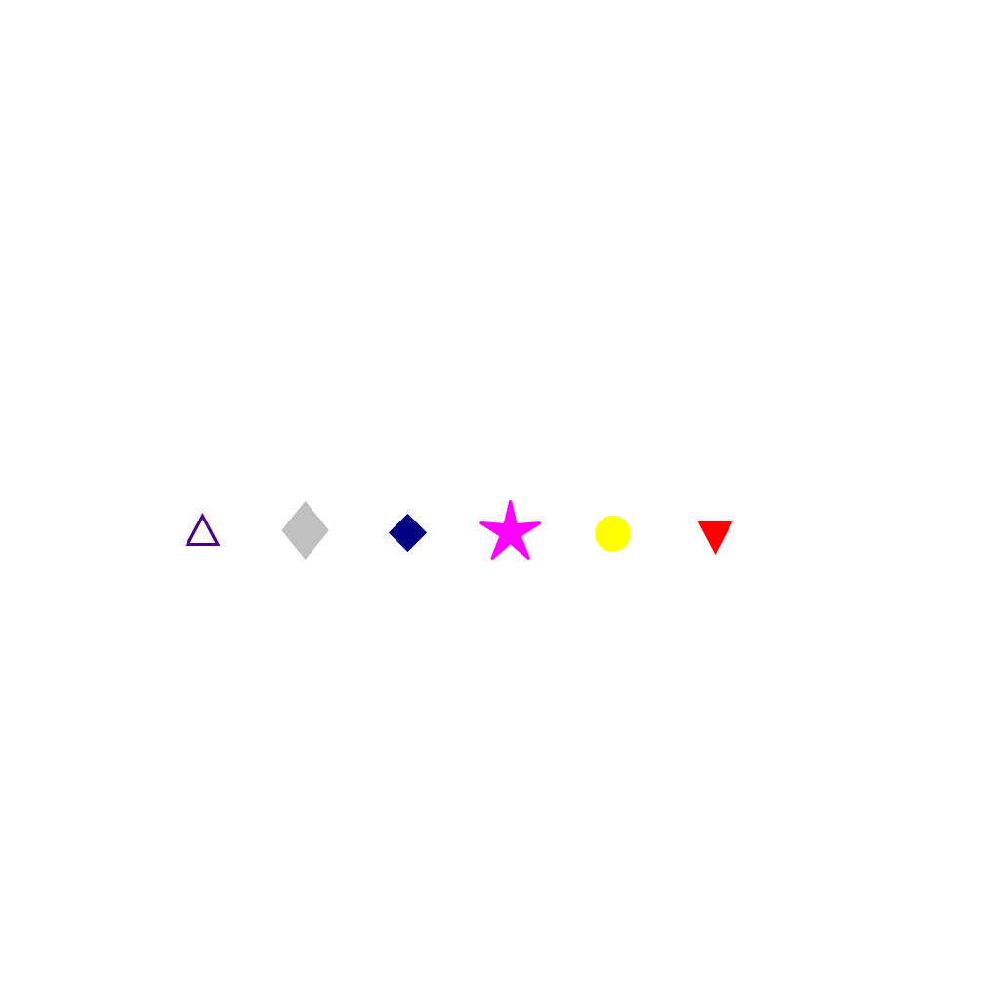
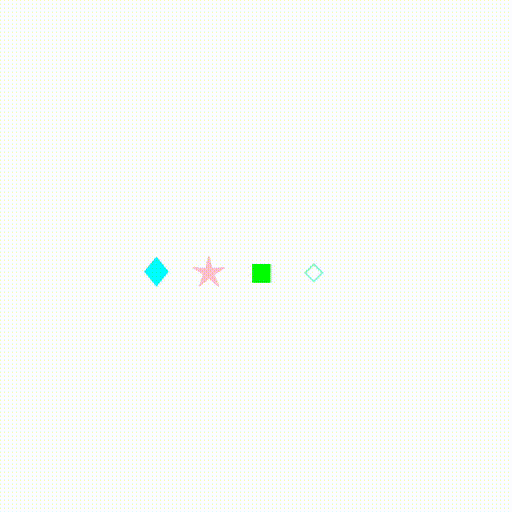
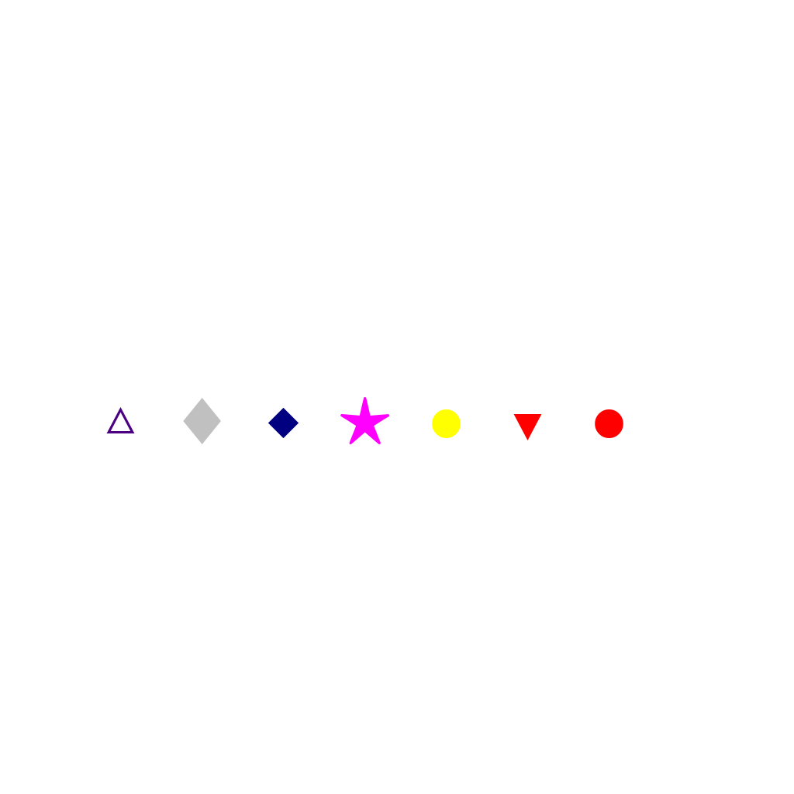

# O-59: Symbol Insert Data Generator

Generates synthetic symbol sequence insertion tasks. The goal is to insert a new symbol at a specific position in a sequence, with the animation showing the symbol fading in above the target position and sliding down while other symbols shift to make room.

Each sample pairs a **task** (first frame + prompt describing what needs to happen) with its **ground truth solution** (final frame showing the result + video demonstrating how to achieve it). This structure enables both model evaluation and training.

---

## 📌 Basic Information

| Property | Value |
|----------|-------|
| **Task ID** | O-59 |
| **Task** | Symbol Insert |
| **Category** | Abstraction |
| **Resolution** | 1024×1024 px |
| **FPS** | 16 fps |
| **Duration** | ~2-3 seconds |
| **Output** | PNG images + MP4 video |

---

## 🚀 Usage

### Installation

```bash
# Clone the repository
git clone https://github.com/Jiaqi-Gong/Gong_VBVR_Data.git
cd Gong_VBVR_Data/O-59_symbol_insert_data-generator

# Install dependencies
pip install -r requirements.txt
```

### Generate Data

```bash
# Generate 100 samples
python examples/generate.py --num-samples 100

# Generate with specific seed
python examples/generate.py --num-samples 100 --seed 42

# Generate without videos
python examples/generate.py --num-samples 100 --no-videos

# Custom output directory
python examples/generate.py --num-samples 100 --output data/my_output
```

### Command-Line Options

| Argument | Type | Description | Default |
|----------|------|-------------|---------|
| `--num-samples` | int | Number of samples to generate | Required |
| `--seed` | int | Random seed for reproducibility | Random |
| `--output` | str | Output directory | data/questions |
| `--no-videos` | flag | Skip video generation | False |

---

## 📖 Task Example

### Prompt

```
Insert a red ● at position 7. The animation shows the new symbol fading in above the target position, then sliding down while other symbols shift to make room.
```
### Visual

<table>
<tr>
  <td align="center"></td>
  <td align="center"></td>
  <td align="center"></td>
</tr>
<tr>
  <td align="center"><b>Initial Frame</b><br/>Symbol sequence before insertion</td>
  <td align="center"><b>Animation</b><br/>Symbol fading in and sliding down</td>
  <td align="center"><b>Final Frame</b><br/>Sequence after insertion</td>
</tr>
</table>

---

## 📖 Task Description

### Objective

Insert a new symbol at a specific position in a sequence, with the animation showing the symbol fading in above the target position and sliding down while other symbols shift to make room.

### Task Setup

- **Sequence Length**: 4-8 symbols (before insertion)
- **Symbol Set**: Shapes (circles, triangles, squares, stars, diamonds, hearts, etc.)
- **Symbol Colors**: 20 distinct colors (rainbow 7 + extended 13)
- **Insert Symbol**: Rainbow-colored symbol (red, orange, yellow, green, blue, indigo, violet)
- **Position**: 1-indexed position where symbol will be inserted
- **Symbol Size**: 85 pixels (adjustable 40-120)
- **Animation**: Fade in above position, slide down, shift other symbols

### Key Features

- **Sequence manipulation**: Tests ability to understand sequence insertion operations
- **Position awareness**: Requires identifying specific insertion position
- **Visual animation**: Clear fade-in and slide-down animation
- **Color coding**: Inserted symbols use rainbow colors for easy identification
- **Symbol variety**: Multiple symbol types and colors for diversity
- **Smooth transitions**: Smooth fading, sliding, and shifting animations

---

## 📦 Data Format

```
data/questions/symbol_insert_task/symbol_insert_00000000/
├── first_frame.png      # Initial state (sequence before insertion)
├── final_frame.png      # Goal state (sequence after insertion)
├── prompt.txt           # Task instructions
├── ground_truth.mp4     # Solution video (16 fps)
└── question_metadata.json # Task metadata
```


**File specifications**: Images are 1024×1024 PNG. Videos are MP4 at 16 fps, approximately 2-3 seconds long.

---

## 🏷️ Tags

`symbol-insert` `sequence-manipulation` `symbol-editing` `abstraction` `position-reasoning` `visual-animation`

---
